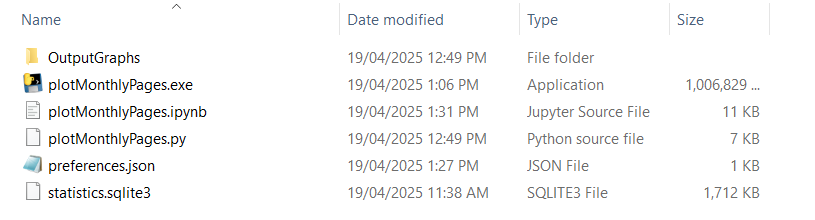

# KOreader-monthly-statistics
A python script to display the pages read from each book through your KOreader in a month. The pages are not based on the physical book's page count, but instead is the screen of your device.

## Included Files:
This repo contains the following folders and files, saved in the Main subfolder:
* **/OutputGraphs:** Folder where the resulting graphs will be exported as a png. This folder can be deleted and the script will recreate the directory when run.
    * **/2025/Pages_Read_in_March.png**: An example of the exported graph with my reading data from March 2025.

* **plotMonthlyPages.ipynb:** A Jupyter Notebook with the code to create the graph. Use this if you prefer Jupyter Notebook and want to edit the script and view outputs as you edit.

* **plotMonthlyPages.py:** A Python script with the code to create the graph. If you are familiar with Python, you can run this file to create the png's.

* **preferences.json:** A JSON file for configuration. 
    * date_info: 
        * current_date: Change current_year and current_month depending on what month you would like to graph.
        * formatting: Change the timezone for your own timezone. I'm not sure if you need to change the date_format, but it's there in case your KOreader's database formatting is region dependent.
    * graph_format:
        * colour_palette: The Seaborn colour palette you want to use for your graph.
        * size (cm): The resulting size of your graph.
    * title_changes: Create an item in the array for every book title you want to change.
 

## Usage Instructions:
* Find your reading statistics database in your KOreader. Mine is in E:\.adds\koreader\settings\statistics.sqlite3. Copy this into the Main folder in this repository.
* Set your preferences.json to what you need.
* If you are familiar with Python, either run the Python script of the Jupyter Notebook.
* If you are not familiar with Python and installing it makes you cry, download this executable file [here](https://drive.google.com/file/d/1GHxMljtDQgpnmt_rMp_Q108tIVRTtmkI/view?usp=sharing) instead. 
    * This exe is more than a GB in size and takes about 45 seconds to run. It was created using Pyinstaller using the instructions found in [this webpage](https://www.datacamp.com/tutorial/two-simple-methods-to-convert-a-python-file-to-an-exe-file). I have no idea what was done to make this exe but I have tested it on my sister's PC. You do not need to install Python to make this work, but you run it at your own potential risk.
    * Simply download it, unzip and the copy the executable into the Main folder

